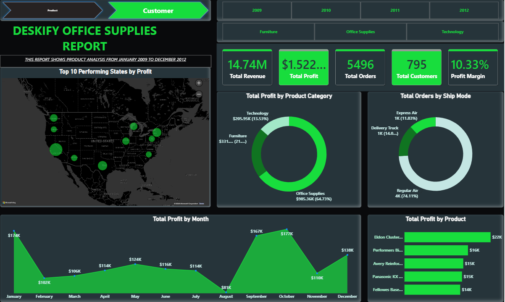
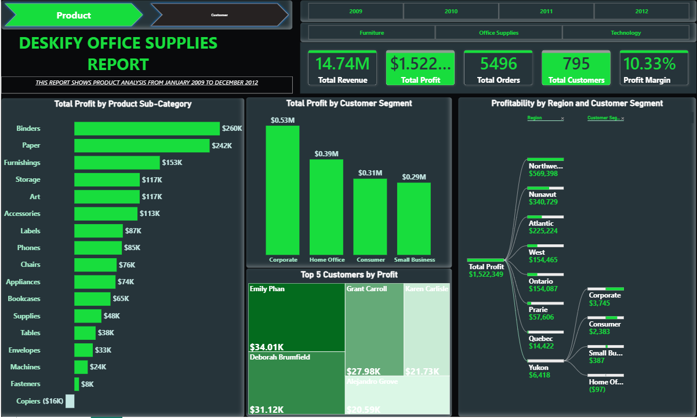

# 🖇️ Deskify Office Supply Co. — Sales & Profitability Dashboard

**A Retail Analytics Case Study | Power BI (Data Modeling & Interactive Reporting)**


> Case study built for **Deskify Office Supply Co.**, a multi-category office supplies, technology, and furniture retailer, to replace error-prone manual Excel reporting with a centralized Power BI data model and interactive dashboard.

📊 **Dashboard preview:**



---

## 📌 Project Overview

| | |
|---|---|
| **Client** | Deskify Office Supply Co. — a retailer of office supplies, technology/computer accessories, and furniture, serving both individual consumers and businesses |
| **Role** | Data Analyst |
| **Tool Used** | Power BI (data modeling, DAX measures, interactive report pages, decomposition tree, drill-through visuals) |
| **Reporting Period** | January 2009 – December 2012 |
| **Data Scope** | 5,496 orders, 795 customers, across 3 product categories and 8 regions |

## 🎯 The Business Problem

Deskify relied on **Excel for compiling, analyzing, and reporting monthly sales and transaction data**. As order volume and data complexity grew, this became increasingly cumbersome:

- Manual data entry and consolidation from multiple sources introduced **errors and inconsistencies**
- Reporting was **time-consuming**, slowing down access to timely business insight
- There was no centralized, single source of truth for sales, profitability, and customer performance

The aim of the project was to **build a proper data model in Power BI**, centralizing Deskify's sales and transaction data, streamlining data cleaning, and delivering an **interactive dashboard** for faster, data-driven decisions — replacing the manual Excel workflow entirely.

## 🗂️ Data Model

The Power BI file is built as a proper **star schema** — a central fact table connected to four dimension tables plus a date table, rather than one flat spreadsheet:

- **TransactionFact** (8,400 rows) — Order ID, Order Date, Order Quantity, Discount, Profit, Unit Price, Shipping Cost, CustID, Postal Code, Product ID, Revenue
- **OrderDim** (5,496 rows) — Order ID, Order Priority, Ship Mode
- **CustomerDim** (795 rows) — CustID, Customer Name, Customer Segment
- **ProductDim** (1,840 rows) — Product ID, Product Category, Product Sub-Category, Product Name
- **LocationDim** (604 rows) — Country, City, State, Postal Code, Region
- **CalendarDim** — a full date table (Date, Year, Month, MonthName, Quarter, Weekday) used for time-intelligence

This structure supports the two-page report built for the project: a **Product Analysis** page and a **Customer Analysis** page, both sharing the same global KPI header and Year/Category filters (2009–2012; Furniture, Office Supplies, Technology).

### Core DAX Measures

```DAX
Total Revenue = SUM(TransactionFact[Revenue])
Total Profit  = SUM(TransactionFact[Profit])
Total Orders  = DISTINCTCOUNT(TransactionFact[Order ID])
Total Customers = DISTINCTCOUNT(TransactionFact[CustID])
Profit Margin = DIVIDE([Total Profit], [Total Revenue])
```

These five measures, evaluated against the star-schema model above, power every KPI card and chart across both report pages — filtering dynamically by year, category, region, and segment as the user interacts with the dashboard.

## 📊 The Dashboard

### Headline KPIs (consistent across both report pages)

| Metric | Value |
|---|---|
| Total Revenue | **$14.74M** |
| Total Profit | **$1,522,349** |
| Total Orders | **5,496** |
| Total Customers | **795** |
| Profit Margin | **10.33%** |

### Page 1 — Product Analysis

- **Total Profit by Product Sub-Category** (bar chart) — full ranked breakdown from Binders ($260K, highest) down to Copiers (–$16K, the only loss-making sub-category)
- **Total Profit by Customer Segment** (bar chart) — Corporate, Home Office, Consumer, Small Business
- **Top 5 Customers by Profit** (treemap)
- **Profitability by Region and Customer Segment** (decomposition tree) — drills from total profit down through region into customer segment

### Page 2 — Customer Analysis

- **Top 10 Performing States by Profit** (map) — bubble-sized by profit contribution across North America
- **Total Profit by Product Category** (donut chart) — Office Supplies, Furniture, Technology
- **Total Orders by Ship Mode** (donut chart) — Regular Air, Delivery Truck, Express Air
- **Total Profit by Month** (area/line chart) — seasonal profit pattern aggregated across the 2009–2012 reporting period
- **Total Profit by Product** (bar chart) — top individual products by profit

## ✅ Key Business Questions — Answered

### Product Analysis

| Question | Answer |
|---|---|
| Which product categories contributed the most to profitability? | **Office Supplies** dominates at **$985.36K (64.73%)** of total profit, followed by **Furniture** (**$331K, ~21.7%**) and **Technology** (**$205.95K, 13.53%**) |
| How does shipping method impact order volume? | **Regular Air** is the dominant shipping method, handling **~74% of all orders (~4K)**, far ahead of **Delivery Truck** (~14%, ~1K orders) and **Express Air** (~12%, ~1K orders) |
| Which 5 products are the most profitable? | **Eldon ClusterMat Chair Mat with Cordless Antistatic Protection** ($22,092), **Performers Binder/Pad Holder, Black** ($16,293), **Avery Reinforcements for Hole-Punch Pages** ($15,088), **Panasonic KX T7736-B Digital phone** ($14,762), and **Fellowes Bases and Tops For Staxonsteel/High-Stak Systems** ($14,297) |
| How has profit evolved over time? | Aggregated by month across the 4-year period, profit **peaks in January ($174,308)**, **declines through the year to a trough in August ($80,891)**, then **rebounds sharply in September–October (peaking at $176,706 in October)** before dipping in November ($109,755) and recovering into December ($137,706) — a clear seasonal pattern rather than a steady linear trend |
| Top 10 states by profitability | **California** ($292,354), **Texas** ($139,087), **New York** ($126,288), **Washington** ($83,886), **Michigan** ($79,927), **Illinois** ($75,537), **Arizona** ($52,428), **Pennsylvania** ($48,359), **Oregon** ($47,001), and **North Carolina** ($44,848) — California alone generates over twice the profit of the next-closest state |

### Customer Analysis

| Question | Answer |
|---|---|
| Which customer segments generated the highest profit? | **Corporate** leads at **$527,150**, followed by **Home Office** ($389,656), **Consumer** ($310,895), and **Small Business** ($294,649) |
| How does profit vary across segment and region? | Profit is heavily concentrated in the **"Northwest Territories" region ($569,398)** — more than double the next-highest region, **Nunavut** ($340,729) — while the smallest region, **Yukon**, generated only **$6,418** in total profit, and within it, **Home Office segment customers were actually unprofitable (–$97)** while Corporate customers there still turned a small profit ($3,745) |
| Which 5 customers are responsible for the largest purchases (by profit)? | **Emily Phan** ($34,005), **Deborah Brumfield** ($31,121), **Grant Carroll** ($27,977), **Karen Carlisle** ($21,732), and **Alejandro Grove** ($20,589) |
| How does each sub-category contribute to profitability? | Full ranked breakdown: **Binders** ($260,135), **Paper** ($241,858), **Furnishings** ($152,810), **Storage** ($116,932), **Art** ($116,780), **Accessories** ($112,845), **Labels** ($86,622), **Phones** ($84,919), **Chairs** ($75,622), **Appliances** ($73,580), **Bookcases** ($64,601), **Supplies** ($48,289), **Tables** ($38,000), **Envelopes** ($32,925), **Machines** ($23,867), **Fasteners** ($8,241), and **Copiers**, the only sub-category operating at a **loss (–$15,677)** |

## 🔍 Key Insights

- **Office Supplies is the profit engine of the business**, generating nearly two-thirds of all profit ($985K, 64.73%) — almost 5x more than Technology — despite Furniture and Technology likely carrying higher unit prices, suggesting strong margins and/or high order volume in everyday office consumables.
- **Copiers are actively losing money** (–$15,677), the only negative sub-category out of 17 — a clear candidate for pricing review, discount-policy review, or discontinuation.
- **Corporate customers are the most valuable segment** ($527K), but the gap to Home Office ($390K), Consumer ($311K), and Small Business ($295K) is relatively narrow — no single segment dominates the way Office Supplies dominates by category.
- **Regional profit is extremely concentrated**: the top region alone accounts for over a third of total company profit ($569K of $1.52M), while the smallest region barely breaks even ($6,418 total) and is actually unprofitable in its Home Office segment specifically — a strong signal for regional strategy review. *(Note: the "Region" field in this dataset uses labels like Northwest Territories, Nunavut, Ontario, Quebec, and Yukon, but the underlying cities are U.S. locations — this is a naming quirk of the sample dataset rather than real Canadian geography, worth flagging if a stakeholder asks.)*
- **At the state level, performance is even more concentrated**: California alone generated $292K in profit — more than double Texas, the second-highest state ($139K) — making it by far Deskify's single most important market.
- **Shipping cost efficiency looks strong**: 74% of all orders (4,073 of 5,496) ship via the cheaper Regular Air method rather than pricier Express Air (12%) or Delivery Truck (14%), which likely supports the company's overall profit margin.
- **Profit is highly seasonal**, with a pronounced trough in August ($80,891) and a strong Q4 rebound peaking in October ($176,706) — useful for planning inventory, staffing, and promotions around known low and high points in the year.
- **Customer profit is concentrated among a small number of top accounts** (top 5 customers each contributing $20K–$34K), indicating an opportunity for targeted retention and account management on Deskify's highest-value relationships.

## 💡 Recommendations

1. **Review the Copiers sub-category** — investigate cost structure, pricing, and discounting practices driving its loss, or consider phasing it out.
2. **Investigate the August profit trough** — assess whether it's driven by seasonal demand, promotions, or cost timing, and plan mitigations (promotions, cost control) ahead of future Augusts.
3. **Prioritize retention programs for top-5 customers and the Corporate segment**, given their outsized contribution to overall profit.
4. **Examine underperforming regions**, particularly segments running at a loss (e.g. Home Office in the lowest-performing region), to decide whether targeted investment or cost reduction is the right response — and consider replicating what's working in California and Texas, the two clear standout state markets.
5. **Continue leveraging Regular Air as the default shipping method** where possible, given its dominant, cost-efficient share of order volume, while monitoring whether faster shipping options are needed for high-priority orders.
6. **Double down on Office Supplies and top sub-categories** like Binders and Paper — they are the clearest, most consistent profit drivers in the business.

## 🛠️ Skills Demonstrated

`Power BI` · `Star-Schema Data Modeling` · `DAX Measures` · `Interactive Dashboard Design` · `Decomposition Trees` · `Geospatial Visualization` · `Retail & Profitability Analytics` · `KPI Development` · `Business Insight Generation`

## 📁 Repository Contents

- `Deskify_Workboard.pbix` — full Power BI file (data model, DAX measures, both report pages)
- `Deskify_Office_Supplies_Dashboard-Product.png` — Product Analysis report page
- `Deskify_Office_Supplies_Dashboard-Customer.png` — Customer Analysis report page
- `Deskify_Office_Supply_Case_Study_Brief.docx` — original project brief
- `README.md` — this write-up

---

*Case study based on the Deskify Office Supply Co. project brief. #PowerBI #DataAnalytics #RetailAnalytics #DataModeling*
Add case Study write-up
